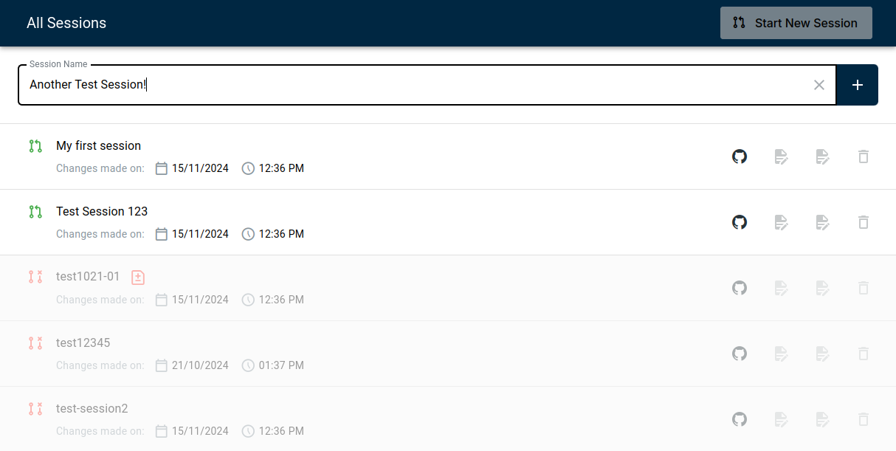

# git-clerk

An Open-Source Content Management System based on Git workflows with a friendly file-editing GUI.



## Purpose

The GitHub UI offers a lot of functionalities which can be overwhelming with users not familiar with Git. This software offers an abstraction on top of GitHub to allow easy creation of forks, PRs, and commits on behalf of the user. On top of that, it offers an automatically rendered form GUI (based on provided JSON schemas) which makes the creation of files easier.

## Functionality

As soon as the user starts a new "Session" (PR), a fork for the target repository is automatically created for the user if not yet present. It also creates an empty commit and a PR for the user. As soon as the user creates/changes files, these are "saved" as commits. Then, the user can mark a session as ready (turn the draft PR into an open PR), and receive feedback regarding failing pipelines or requested changes on the PR.

## Configuration

The configuration for git-clerk is done via the [config file](/public/config.js). In its most basic form, the config looks like this:

```js
globalThis.ghConfig = {
  // The target repository to create PRs against
  githubRepo: "EOX-A/git-clerk-demo",
  // The current user's GH token, either as string or (sync or asyn) function
  // Example: githubAuthToken: () => "<github-token>"
  // Example: githubAuthToken: () => new Promise((resolve) => fetch("<endpoint>").then(() => resolve(token))),
  githubAuthToken: "ghp_myGithubAuthToken",
};
```

You can also set this GitHub config via an `.env` variable, by passing `GITCLERK_GITHUB_TOKEN` and `GITCLERK_GITHUB_REPO` see e.g. [.env.example](./.env.examle).

## Features

### `schemaMap`

With the `schemaMap`, one can configure which file paths are associated with which JSON schemas to automatically render input forms.

#### `schema` and `url`

```js
globalThis.schemaMap = [
  {
    path: "/folder-a/file.json",
    schema: {
      title: "my-schema",
      type: "object",
      properties: {
        foo: {
          type: "string"
        }
      }
    }
  },
  {
    path: "/folder-a/<id>/file.json",
    url: "https://my-schema-site.com/schemas/folder-a/schema.json",
  },
  [...]
]
```

In this example, editing the file `/folder-a/file.json` loads the corresponding JSON schema passed via the `schema` property, whereas editing a file with the pattern `/folder-a/<id>/file.json` loads the corresponding JSON schema `https://my-schema-site.com/schemas/folder-a/schema.json`.

#### `content`

Additionally to providing a JSON schema, the form can also be autofilled with initial content:

```js
globalThis.schemaMap = [
  {
    path: "/folder-a/file.json",
    schema: {
      title: "my-schema",
      type: "object",
      properties: {
        foo: {
          type: "string"
        }
      }
    },
    content: {
      foo: "bar"
    }
  },
  [...]
]
```

In this example, the generated form will automatically fill the value "bar" into the `foo` field.

#### `output`

By default, the entire JSON structure is stored (commited) as a JSON file. But one can also specify a specific property which should be stored in the file instead. This is handy when e.g. editing markdown or yaml files:

```js
globalThis.schemaMap = [
  {
    path: "/folder-a/file.md",
    schema: {
      title: "my-schema",
      type: "object",
      properties: {
        foo: {
          type: "string",
          format: "markdown"
        }
      }
    },
    output: "foo"
  },
  [...]
]
```

In this example, the markdown content of `foo` is commited as file `file.md`.

#### `preview`

If a `preview` is defined, then the editor GUI only takes half of the screen, and the other half renders the referenced preview HTML inside an iframe. Whenever the editing form updates, it sends a `postMessage` including a `CustomEvent` to the preview iframe with the `event.type` of `SCHEMA_DATA_EDITOR_UPDATE` and the `event.detail` being the JSON output of the editor. The preview iframe can also emit a `CustomEvent` to the parent with the `event.type` of `SCHEMA_DATA_PREVIEW_UPDATE`, which then updates the editor (in `event.detail` it expects the JSON value that matches the currently loaded JSON schema).

An example for this setup can be seen in [here](https://github.com/EOX-A/git-clerk/blob/f658c6ec4604d6f0da7fe237f3f56e27a8fa0e58/public/storytelling.html).

### `automation`

Sometimes, multiple edits need to be done together (e.g. creating a file in the correct folder structure, putting initial content in that file, and referencing this file in a third file). To make users' lives easier, git-clerk offers automations:

```js
globalThis.automation = [
  {
    title: "Bootstrap Product", // displayed in the UI as button
    description: "Bootstrap a new file with the correct folder structure and ID.", // displayed in the UI as description for this automation
    inputSchema: { // the input form when the user selects this automation
      type: "object",
      properties: {
        id: {
          type: "string",
          minLength: 1
        },
        title: {
          type: "string",
          minLength: 1
        }
      },
      required: ["id", "title"]
    },
    steps: [ // the steps the automation will perform
      {
        type: "add", // add a file
        path: (input) => `/products/${input.id}/collection.json`, // references the above defined form output property "id"
        content: (input) => ({ id: input.id, title: input.title }) // sets the content of the added file, referencing "id" and "title" from the form
      },
      {
        type: "edit", // edits an existing file
        path: "/products/catalog.json",
        transform: (content, input) => { // transforms the content of an existing file
          content.links = [
            ...content.links,
            {
              rel: "child",
              href: `./${input.id}/collection.json`,
              type: "application/json",
              title: input.title
            },
          ]
          return content
        }
      },
      {
        type: "navigate", // navigates to the specified file and opens the editing view
        path: (input) => `/products/${input.id}/collection.json`
      }
    ]
  },
  [...]
]
```

### Custom Editor Interface

Git Clerk uses `eox-jsonform` to render applications based on different JSON editor schemas. `eox-jsonform` contains editor interfaces for each of the primitive JSON types as well as a few other specialized ones. For those who need custom editor interfaces/inputs based on any custom format, they can easily build their own custom editor interface using `JSON Editor`'s `AbstractEditor` class inside `config.js`.

```js
globalThis.customEditorInterfaces = {
  "some-format-key-name": {
    type: "string", // Any data type for the custom editor
    format: "any-custom-format", // Any custom format key
    func: CustomEditorInterface, // Build any custom editor using `JSON Editor`'s `AbstractEditor` class
    ... // Add any key values as per your business logic
  },
};
```

An example for this setup can be seen in [here](https://github.com/EOX-A/git-clerk/blob/bfa157a499ef488fe3b0ebf3215fb9368d552496/public/config.js#L680).

### Generate Enums

Sometimes input enums need to be dynamically fetched from an API or other data source to update the schema. `globalThis.generateEnums` inside `config.js` allows users to fetch dynamic enums according to their business logic and then return the updated schema.

```js
globalThis.generateEnums = async (
  schemaMetaDetails,
  session,
  cache,
  { getFileDetails },
) => {
  ... // Fetch dynamic enums based on the API and update the schemaMetaDetails
  return schemaMetaDetails; // Return the updated schema based on the processing above
}
```

An example for this setup can be seen in [here](https://github.com/EOX-A/git-clerk/blob/bfa157a499ef488fe3b0ebf3215fb9368d552496/public/config.js#L724).

## Development

### Recommended IDE Setup

[VSCode](https://code.visualstudio.com/) + [Volar](https://marketplace.visualstudio.com/items?itemName=Vue.volar) (and disable Vetur).

### Customize configuration

See [Vite Configuration Reference](https://vitejs.dev/config/).

### Project Setup

```sh
npm install
```

#### Compile and Hot-Reload for Development

```sh
npm run dev
```

#### Compile and Minify for Production

```sh
npm run build
```
